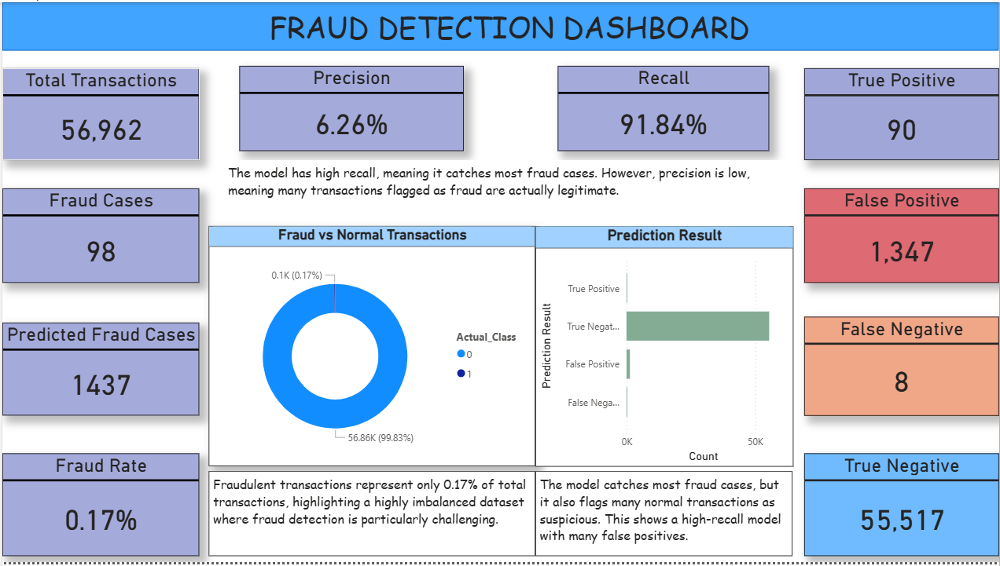

# Fraud-Detection-Project

Fraud detection project with ML and Power BI dashboard
# 💳 Fraud Detection & Machine Learning Project

##  Overview

This project focuses on detecting fraudulent credit card transactions using machine learning. It combines SQL, Python, and Power BI to build an end-to-end data analysis and modeling pipeline.

---

##  Tools & Technologies

* SQL (data exploration)
* Python (Pandas, Scikit-learn)
* Power BI (dashboard & visualization)

---

##  Dataset

The dataset contains anonymized credit card transactions, with fraud representing only ~0.17% of total data, making this a highly imbalanced classification problem.

---

##  Key Analysis

* Fraud is rare and difficult to detect
* Fraudulent transactions often mimic normal behavior
* Most transactions occur at low values

---

##  Machine Learning

Two models were tested:

### Logistic Regression

* Recall: ~92%
* Precision: ~6%
* Captures most fraud but produces many false positives

### Random Forest

* High precision but very low recall
* Misses most fraud cases

---

##  Model Insight

The final model prioritizes **recall**, ensuring that most fraudulent transactions are detected, even at the cost of increased false positives.

---

##  Dashboard

The Power BI dashboard presents:

* Fraud rate and transaction overview
* Model performance (True/False Positives & Negatives)
* Precision and Recall metrics

## 📊 Dashboard Preview

  

*Fraud Detection Dashboard showing model performance, class imbalance, and prediction results.*

---

##  Conclusion

Fraud detection requires balancing precision and recall. This project demonstrates how machine learning models can identify fraud patterns while highlighting the trade-offs involved.

---

##  Future Improvements

* Improve precision through threshold tuning
* Explore advanced models (e.g., XGBoost)
* Deploy as a real-time fraud detection system

---

## 👩🏽‍💻 Author

Freke – Data Analyst | Aspiring Data Scientist
